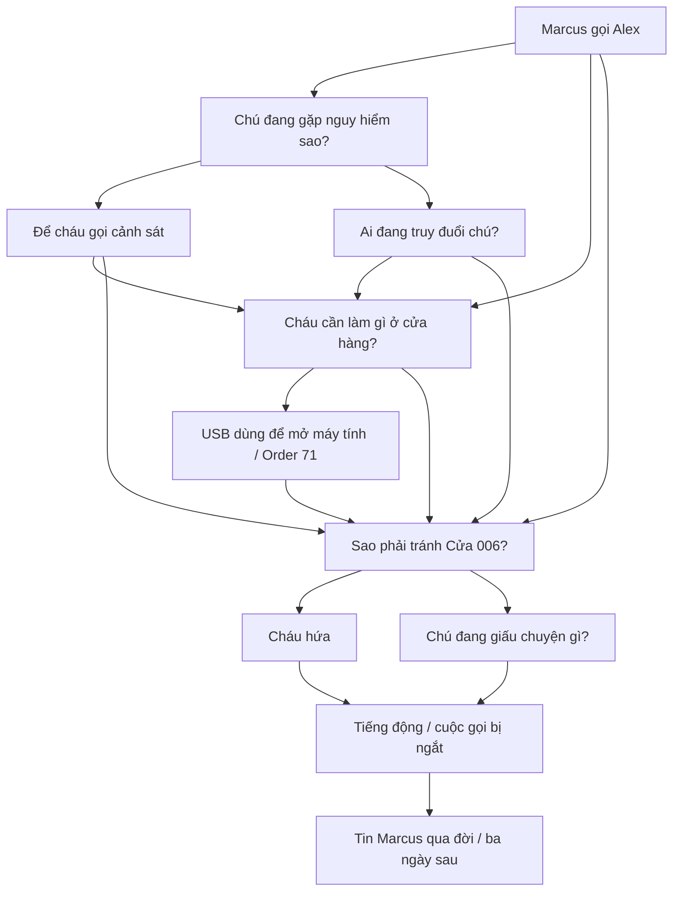

# Mở đầu màn 1 — cuộc gọi cuối cùng

Mở `Assets/BlackMarket/Scenes/NorthPoint.unity`, bấm Play rồi **BẮT ĐẦU CHIẾN DỊCH**. Điểm lưu đã hoàn tất phần mở đầu sẽ đi thẳng vào cửa hàng khi chọn **TIẾP TỤC ĐIỂM LƯU**.

## Luồng hoạt cảnh

1. 02:17, Alex ngồi ở bàn máy tính trong phòng ngủ. Phòng có giường, giá sách, bàn, ghế, cửa sổ và cửa phòng.
2. Điện thoại reo, Alex đưa điện thoại lên tai. Người chơi chọn lời đáp trong cuộc gọi với Marcus.
3. Từng lời thoại chạy chữ; sau ký tự cuối cùng **3 giây** các lựa chọn mới sáng. Tạm dừng không làm trôi thời gian đọc.
4. Cuộc gọi bị ngắt. Tin Marcus qua đời xuất hiện vào sáng hôm sau. Ba ngày sau, Alex tới North Point.
5. Alex đi xe máy tới, xuống xe và tự đi tới gần cửa chính. Camera cắt vào bên trong cửa hàng, bỏ qua động tác đi qua cửa; sau đó mới trả quyền điều khiển.
6. Nhiệm vụ cũ tiếp tục: tìm USB đỏ trong ngăn kéo → máy tính → Order 71 → nhóm người mặc vest → Cửa 006 → quét mặt → xuống hầm.

## Cây hội thoại dùng cho bài tập

Dữ liệu: `Assets/BlackMarket/Scripts/PhoneDialogue.cs`. Mỗi node có người nói, nội dung và các lựa chọn gồm câu trả lời, node tiếp theo, tác động. Đây là cây phân nhánh có các điểm hội tụ; không phải chuỗi văn bản tuyến tính.

Các lựa chọn có tác động riêng:

- Hỏi về USB: nhật ký ghi cụ thể các ngăn kéo sát tường và tệp Order 71.
- Hỏi về kẻ truy đuổi: nhật ký ghi cảnh báo về nhóm người mặc vest đen.
- Hứa tránh Cửa 006: khi dùng USB tại cửa, Alex nói “Cháu xin lỗi, chú Marcus… cháu không còn đường nào khác.”

Dù chọn nhánh nào, nhiệm vụ chính vẫn cung cấp đủ thông tin để hoàn thành màn. Lựa chọn được lưu cùng điểm lưu sau hoạt cảnh. Bắt đầu chiến dịch mới xóa lựa chọn cũ; quyền bỏ qua phần đã xem được lưu riêng. Thoát giữa phần mở đầu rồi tiếp tục sẽ bắt đầu lại cuộc gọi, tránh bỏ qua nội dung lần đầu.

## Chỉnh sửa trong Unity

- Phòng ngủ: mở prefab `Assets/BlackMarket/Resources/Opening/AlexBedroom.prefab`. Kéo thả các đồ vật ở đây; vị trí gốc của prefab là tâm phòng. Bàn và ghế có liên hệ với điểm ngồi trong `PrologueSequence.cs`.
- Xe máy: `Assets/BlackMarket/Resources/Opening/AlexMotorcycle.prefab`; các điểm Seat, Left grip và Right grip được đặt sẵn để tham khảo khi chỉnh model.
- Luồng/camera/thời gian: `PrologueSequence.cs`. `ParkPosition` là vị trí xe đỗ để nhóm truy bắt nhận ra xe Alex.
- Tư thế ngồi, nghe điện thoại, lái xe: `IntroActorPose.cs`; tay đi khom: `CrouchPose.cs`.
- Chỉ dựng lại hai prefab mới bằng **BLACK MARKET / Build bedroom and motorcycle only** nếu cần khôi phục bố cục mặc định. Lệnh này ghi lại hai prefab, không dựng lại map cửa hàng.

Model xe: Duhgless, *Yet Another PSX Style Low Poly Bike*, CC0. Đây là model low-poly có texture, không phải model quang thực. Chuyển động nghe điện thoại/ngồi xe/xuống xe dùng điều chỉnh xương và nội suy; chưa có lồng tiếng.

## Kiểm tra bản hiện tại

- `intro-ui-test.txt`: 45 kiểm tra đạt, 0 lỗi; chạy trong Unity Game View, gồm bấm lựa chọn thật, nhịp đọc 3 giây, khóa điều khiển, tạm dừng, hai tay ở tay lái, hướng xe, lưu lựa chọn, bỏ qua khi chơi lại và nối sang truy đuổi.
- `controls-test.txt`: kiểm tra hồi quy điều khiển và tư thế đi khom đều đạt; có kiểm tra bước chân luân phiên, chiều cao khi khom, tạm dừng và phục hồi tư thế đứng.
- Ảnh kiểm tra thực tế: thư mục `Documentation/IntroPreview/`. Chưa xuất APK hoặc đo hiệu năng trên thiết bị Android thật.

Bản cập nhật ba màn và hướng dẫn chỉnh hai tầng ngầm: [UNDERGROUND_CAMPAIGN_VI.md](UNDERGROUND_CAMPAIGN_VI.md).
