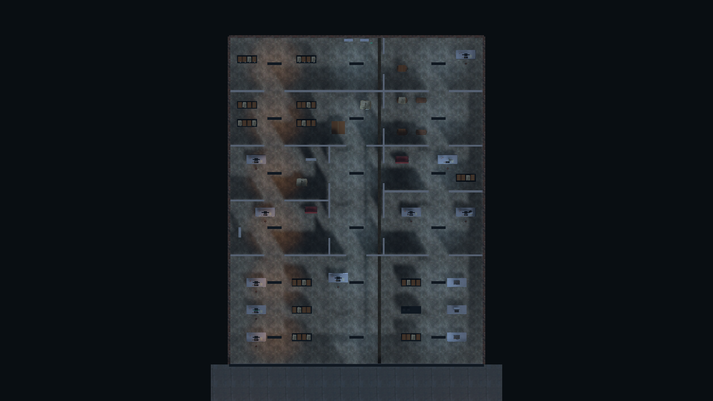

# Cửa hàng và tuần tra đèn pin

Bản đồ cửa hàng được dựng lại trong `Assets/BlackMarket/Editor/ShopLayout.cs`. Diện tích trong nhà 28 × 36 m, gồm khu bán hàng/quầy dịch vụ, trưng bày TV, văn phòng Marcus, phòng hồ sơ/nhân viên, khu nhận sửa chữa, xưởng kiểm tra, kho và giao nhận. Hành lang giữa có các cửa bên nối thành vòng qua các phòng; kho phía sau có vách ngang và lối đi lệch. Không còn đường nhìn thẳng từ cửa trước tới Door 06.

## Vật dụng và chỗ núp

- 12 bộ kệ mở ở khu bán hàng/kho, thêm kệ phụ tùng trong xưởng; khung thép và từng tầng có va chạm riêng.
- Hàng trăm hộp hàng, nhãn, băng dán và chi tiết bàn sửa chữa; TV, radio, tủ dụng cụ, bàn, ghế, đèn bàn, máy tính, bàn phím, giấy tờ, tua vít, thùng gỗ và carton.
- Bổ sung model Poly Haven `Television_01`, `television_02`, `cardboard_box_01`; metadata và giấy phép CC0 trong media-manifest.json/ASSET_CREDITS.md.
- Kệ mở không dùng một khối collider kín. Tầm nhìn có thể đi qua khe trống; hàng hóa/khung kệ chặn đúng phần có hình học. Thùng thấp che khi khom; đứng lên có thể lộ đầu. Tư thế khom hạ xương chậu và giải chân về vị trí bàn chân trong animation bằng IK; collider hạ còn 1,25 m, kiểm tra khoảng trống trước khi đứng dậy. Đây là tư thế điều chỉnh bằng code, chưa có clip mocap crouch riêng. Tường và đồ vật có collider đều chặn đạn ở phiên bản này; chưa có xuyên đạn/phá hủy carton.

## Lính tuần tra

Hai lính ở chương Visitors Arrive tuần tra theo hai lộ trình nối kho với các phòng giữa. Bình thường cất súng, cầm đèn pin. Đèn có góc chiếu 48°, tầm 14 m, đổ bóng; phát hiện kiểm tra thân/đầu người chơi và vật cản từ nguồn đèn. Tiếp xúc ở khoảng cách rất gần vẫn có thể bị nhận biết ngoài góc đèn.

Thấy thoáng qua làm tăng nghi ngờ. Đi khom tăng thời gian cần để xác nhận. Khi xác nhận, lính chuyển sang súng, đưa tay từ hông lên trong khoảng 0,7 giây rồi mới được bắn. Đây là chuyển động điều chỉnh bằng code trên rig, chưa phải clip mocap rút súng riêng.

Mất tầm nhìn: lính đi tới vị trí cuối cùng nhìn thấy rồi tìm kiếm; không lấy vị trí hiện tại của người chơi xuyên tường. Sau khoảng 12 giây không phát hiện lại, cất súng và trở lại tuần tra. Tiếng động/radio khiến lính chưa báo động đi kiểm tra bằng đèn pin. Bật/tắt đèn phòng bằng Tablet không tắt đèn pin của NPC.

## Âm thanh

Đi bộ, chạy, đi khom có nhịp và âm lượng khác nhau. NPC phát bước chân theo vận tốc thực của NavMeshAgent. Bắn, nạp và rút súng có âm thanh; nguồn âm có vị trí. Vật cản giữa nguồn và người chơi làm giảm âm lượng và lọc bớt âm cao. Mưa và âm nền cơ sở vẫn hoạt động.

## Chạy và kiểm tra

Chạy `./play-linux.sh`, chọn **BẮT ĐẦU CHIẾN DỊCH** để thấy cửa hàng mới. Lính xuất hiện sau sự kiện mất điện của chương 2. Checkpoint cũ ở khu ngầm sẽ tiếp tục tại khu ngầm.

`--self-test --capture` dùng save kiểm thử riêng. Bộ kiểm tra xác nhận tầm đèn, vật cản, đi khom, nghi ngờ, khoảng chờ rút súng, bắn, tìm kiếm, nhớ vị trí cuối, trở lại tuần tra và phản ứng âm thanh; kiểm tra chiến dịch cũ cũng được chạy lại. Báo cáo kết quả trong runtime-test.txt, ảnh trong Playtest, NavMesh/patrol trong validation.txt.

Giới hạn: chưa đo hiệu năng/cảm ứng trên điện thoại thật. Kiểm thử tự động và ảnh render không thay thế một lượt chơi tay đầy đủ để đánh giá độ khó.
